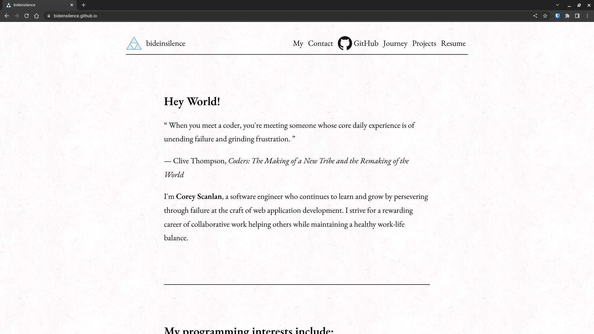

# My Personal Site



bideinsilence.github.io

**Link to site:** https://bideinsilence.github.io/


## How It's Made:

- Valid, semantic, and responsive HTML and CSS
- CSS Flexbox, Grid, and custom properties

**Tech used:** HTML, CSS, and a touch of JavaScript

I know that many people use a template or site builder for their personal sites,
especially if they are not much of a designer such as myself, but I wanted to
use building my own personal piece of the internet as a another opportunity to
practice and refine my HTML and CSS skill. One of my favorite hobbies has always
been reading, so I aimed to keep this site simple and for it to look similar to
reading a paperback book.


## Optimizations

This site is very lightweight, responsive, and effecient. I used a dynamic root
font-size as part of my responsive design: 
```
    /* 1rem ensures font-size never drops below the default value */
    font-size: calc(1rem + 0.5vw);
    font-size: clamp(1rem, 1rem + 0.5vw, 2rem);
```


## Lessons Learned:

I've built enough sites from scratch now to truly appreciate the time and effort
saved by starting with a template and using a static site generator or dynamic
back end with a template engine and a CSS library. However, it's encouraging to
know that I can build a site from scratch if I ever need to and to know that
I'll enjoy the process and recognize the value in keeping things simple.

